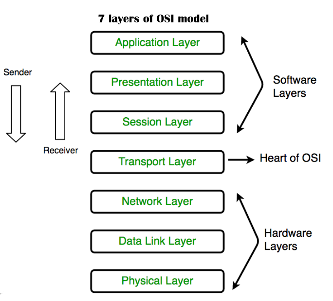

# 🛰️ OSI Model: Detailed Summary with Real-Time Protocol Examples

The OSI (Open Systems Interconnection) Model is a standardized framework used to understand and implement network communication. It consists of **seven layers**, each handling specific responsibilities in the communication process.

---

---

## 🔹 Layer-by-Layer Explanation with Real-World Protocols

### 7️⃣ Application Layer (Layer 7)
This is the topmost layer where the **user interacts with applications**. It handles network services such as email, file transfers, and browsing.  

**🧠 Real-World Protocols:**  
- **HTTP/HTTPS** – Web browsing (Chrome, Firefox)  
- **FTP** – File transfer  
- **SMTP/IMAP/POP3** – Email sending and receiving  
- **DNS** – Resolves domain names to IP addresses  
- **Telnet/SSH** – Remote login

**🧪 Example:** When you open WhatsApp or Gmail, your device uses HTTPS to communicate securely with the server.

---

### 6️⃣ Presentation Layer (Layer 6)
Responsible for **data format translation, encryption, and compression**. It ensures data sent from the application layer of one system is readable by the application layer of another.

**🧠 Real-World Protocols:**  
- **TLS/SSL** – Encryption for secure web (HTTPS)  
- **JPEG, PNG** – Image formats  
- **MPEG, MP4** – Media encoding  
- **ASCII, UTF-8** – Text encoding formats

**🧪 Example:** When visiting your bank’s website, the browser and server use TLS to encrypt your data, protecting it from hackers.

---

### 5️⃣ Session Layer (Layer 5)
This layer is responsible for **establishing, maintaining, and terminating sessions**. It keeps track of the dialog (session) between two systems.

**Dialog**

A **dialog** or **session** refers to a **controlled, structured communication between two devices** (like your computer and a server), where both sides know:

- **When the conversation starts**
- **Who is allowed to talk (and when)**
- **When the conversation ends**

**🧠 Real-World Protocols:**  
- **NetBIOS**, **RPC** – Windows networking  
- **SIP** – Voice over IP session control  
- **SMB** – File sharing over a network

**🧪 Example:** During a Zoom or Skype call, the session layer manages the conversation between your device and the server.

---

### 4️⃣ Transport Layer (Layer 4)
Provides **reliable or fast delivery** of data across the network. It supports **error recovery, retransmission, and flow control**.

**🧠 Real-World Protocols:**  
- **TCP (Transmission Control Protocol)** – Reliable, ordered delivery (used in HTTP, FTP)  
- **UDP (User Datagram Protocol)** – Faster, no guaranteed delivery (used in video streaming, games)

| Feature                     | **TCP (Transmission Control Protocol)**       | **UDP (User Datagram Protocol)**           |
|----------------------------|------------------------------------------------|--------------------------------------------|
| **Connection Type**        | Connection-oriented (requires handshake)       | Connectionless (no handshake)              |
| **Reliability**            | Reliable – ensures packet delivery             |  Unreliable – no guarantee                |
| **Ordering of Data**       | Maintains order of packets                     |  May arrive out of order                  |
| **Error Checking**         | Yes – with retransmissions                     |  Yes – but no retransmission              |
| **Speed**                  | Slower due to overhead                         | Faster due to minimal overhead             |
| **Use of Acknowledgment**  | Uses ACKs for confirmation                     |  No acknowledgment mechanism              |

**🧪 Example:** Watching YouTube uses TCP to ensure video chunks load correctly, while multiplayer games may use UDP for low-latency performance.

---

### 3️⃣ Network Layer (Layer 3)
Handles **routing of packets** across networks using **logical addressing (IP addresses)**. It determines the best path for data.

**🧠 Real-World Protocols:**  
- **IP (Internet Protocol)** – Addressing and routing  
- **ICMP** – Used for diagnostic tools like ping  
- **IGMP** – Multicast communication

**🧪 Example:** When you open `https://www.google.com`, DNS resolves the domain to an IP address, and Layer 3 ensures packets reach Google's server via routers.

---

### 2️⃣ Data Link Layer (Layer 2)
Controls **how data is formatted for transmission over a physical link**. It uses **MAC addresses** to identify devices on the same network.

**🧠 Real-World Protocols:**  
- **Ethernet (IEEE 802.3)** – Wired LAN  
- **Wi-Fi (IEEE 802.11)** – Wireless LAN  
- **ARP (Address Resolution Protocol)** – IP-to-MAC address resolution

**🧪 Example:** When your laptop sends a request through Wi-Fi, the router uses the MAC address to identify your device and deliver the correct packet.

---

### 1️⃣ Physical Layer (Layer 1)
Deals with the **physical transmission of raw bits** (0s and 1s) over a communication medium — such as cables or radio waves.

**🧠 Real Components:**  
- **Ethernet cables, fiber optics**  
- **Radio signals for Wi-Fi/Bluetooth**  
- **Hubs, Repeaters, Network adapters**

**🧪 Example:** When you plug in an Ethernet cable, Layer 1 transmits the data signals using electrical impulses.

---

## 🌐 Complete Example: Accessing Gmail in OSI Terms

Imagine you open your browser and visit `https://www.gmail.com` — here’s how each layer is involved:

| Layer | Description                                                                 |
|-------|-----------------------------------------------------------------------------|
| 7 – Application     | Browser uses HTTPS to request Gmail.                          |
| 6 – Presentation    | TLS encrypts your email data.                                 |
| 5 – Session         | Session established with Gmail server.                        |
| 4 – Transport       | TCP ensures reliable delivery of data packets.                |
| 3 – Network         | IP addresses determine the best route through the internet.   |
| 2 – Data Link       | MAC address used for local network delivery (Wi-Fi/Ethernet). |
| 1 – Physical        | Bits transmitted over Wi-Fi signals or Ethernet cables.       |

---

## 📌 Summary Table: OSI Layers and Protocol Examples

| Layer | Name             | Key Protocols/Technologies                          |
|-------|------------------|-----------------------------------------------------|
| 7     | Application      | HTTP, HTTPS, FTP, SMTP, DNS                         |
| 6     | Presentation     | TLS/SSL, JPEG, MPEG, ASCII                          |
| 5     | Session          | NetBIOS, SIP, SMB, RPC                              |
| 4     | Transport        | TCP, UDP                                            |
| 3     | Network          | IP, ICMP, IGMP                                      |
| 2     | Data Link        | Ethernet, Wi-Fi (802.11), ARP                       |
| 1     | Physical         | Cables, Hubs, Radio, Fiber Optics                   |

---

